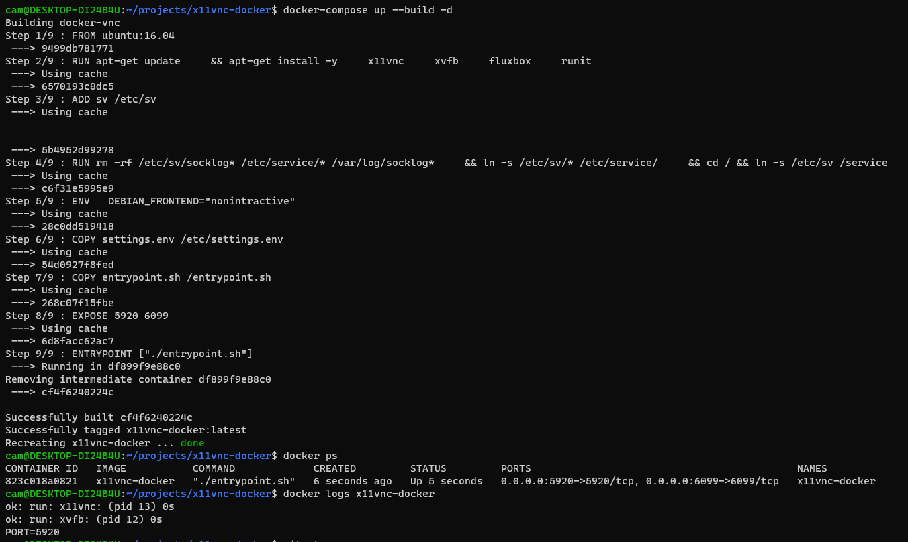

# README

This is a simple Docker container running x11vnc launched via `runit` to allow
process control using `sv` commands. Runit finds services to run by looking
in `/etc/services`, where there should be a `run` shell script to specify
process dependencies and launch commands.

## Usage

### Build


```bash
brew install --cask vnc-viewer

docker-compose up -d
```

Expected output:



Open vncviewer, enter address: `localhost:5920`


### Edit

To modify and rebuild image:

```bash
docker-compose up --build -d
```

Install submodules:

```bash
git submodule init; git submodule update
```


### TODO

- [ ] add dbus to starting services
- [ ] add novnc?

## Resources

- https://qxf2.com/blog/view-docker-container-display-using-vnc-viewer/
- https://github.com/jupemara/x11vnc-docker
